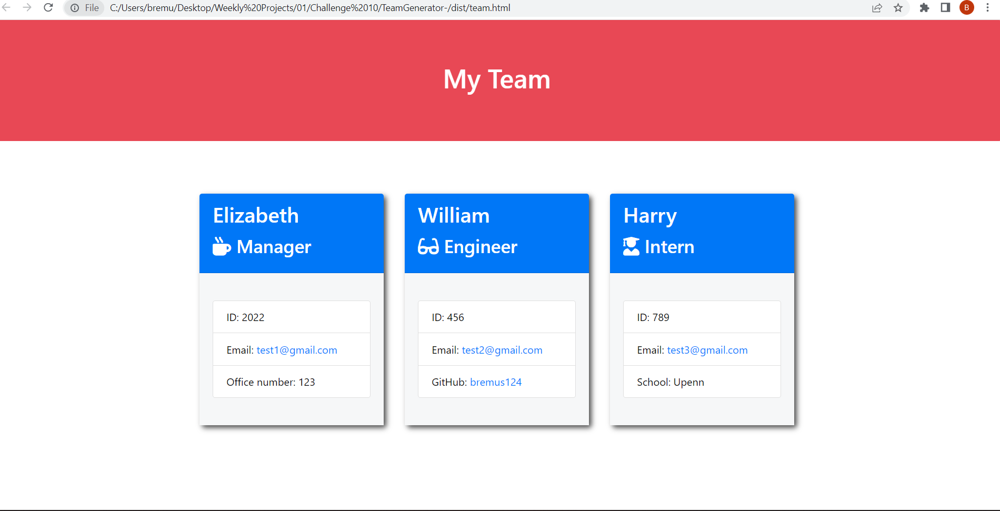

# TeamGenerator-

- ## Built a Node.js command-line application that takes in information about employees on a software engineering team and generates an HTML webpage that displays summaries for each person.

## Author

- ## [@brittanyremus](https://www.github.com/bremus124)

## Screenshot

--

## Deployment

- To deploy this project run:
  - Video Link: https://bremus124.github.io/Scheduler/
  - Repository: https://github.com/bremus124/TeamGenerator-
